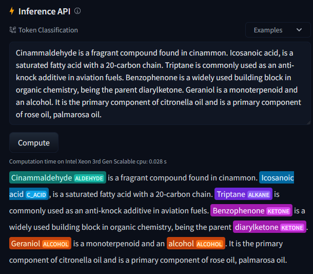

# ChemNER
A custom NER model for extracting and labeling chemical compounds from text. This model will extract chemical compounds from a piece of text and label it as one of the following 7 classes:
* ALKANE
* ALKENE
* ALKYNE
* ALCOHOL
* ALDEHYDE
* KETONE
* CAROBOXYLIC ACID (C_ACID)

The model has been deployed in a Streamlit application that also performs Named Entity Linking (NEL) via the PubChem API in order to improve the labeling accuracy by removing entities that are not chemical compounds.

The Streamlit app also provides an annotation visualization for the uploaded text that has color coded labels for all the extracted entities. 

Finally, the Streamlit app also has a built-in Wikipedia-API connection to allow for quick querying for Wikipedia articles.

# Example Usage

  

# Installation
There are a variety of ways to access the model. The model is hosted in HuggingFace here: 

https://huggingface.co/victormurcia/en_chemner

!pip install https://huggingface.co/victormurcia/en_chemner/resolve/main/en_chemner-any-py3-none-any.whl

## Using spacy.load().
import spacy

nlp = spacy.load("en_chemner")

## Importing as module.
import en_chemner

nlp = en_chemner.load()

# Questions/Bugs
Open an issue ticket or send me an email to victor.murcia@wsu.edu
